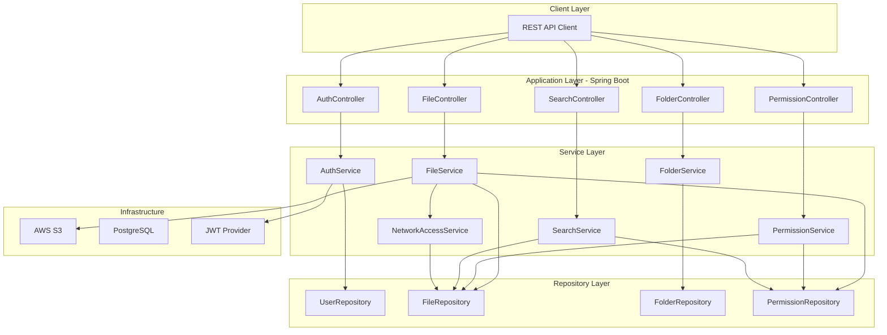
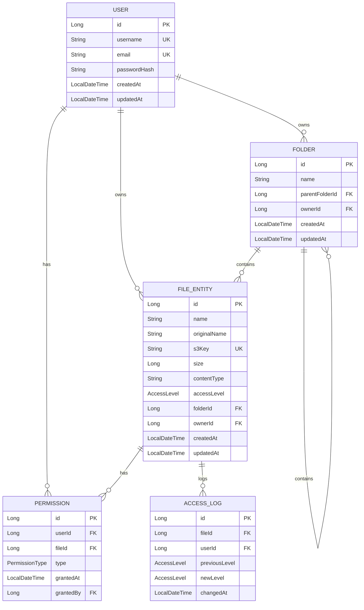

# Design Document: File Storage System

## Overview

Hệ thống File Storage được xây dựng bằng Java Spring Boot, sử dụng kiến trúc layered architecture (Controller → Service → Repository). File thực tế lưu trên AWS S3, metadata lưu trên PostgreSQL. Hệ thống phân biệt file nội bộ (LAN) và public (Internet) thông qua IP-based access control. Authentication sử dụng JWT. Project tuân thủ OOP và SOLID principles, phù hợp làm demo cho người học DevOps triển khai bằng Terragrunt trên AWS.

## Architecture



### Layered Architecture

Hệ thống tuân theo Layered Architecture pattern:

1. **Controller Layer**: Nhận HTTP request, validate input, delegate sang Service layer
2. **Service Layer**: Chứa business logic, orchestrate giữa các component
3. **Repository Layer**: Truy cập database thông qua Spring Data JPA
4. **Infrastructure Layer**: Tích hợp AWS S3, JWT, network filtering

### SOLID Principles Application

- **Single Responsibility**: Mỗi service chỉ xử lý một domain (FileService xử lý file, PermissionService xử lý quyền)
- **Open/Closed**: Sử dụng interface cho storage strategy (S3StorageStrategy implements StorageStrategy), dễ mở rộng sang storage khác
- **Liskov Substitution**: Các implementation có thể thay thế interface mà không ảnh hưởng behavior
- **Interface Segregation**: Tách interface nhỏ (StorageStrategy, AccessValidator, PermissionChecker)
- **Dependency Inversion**: Service layer depend on abstraction (interface), không depend trực tiếp vào implementation

## Components and Interfaces

### Core Interfaces

```java
// Storage abstraction - OCP: có thể thêm LocalStorageStrategy, AzureStorageStrategy...
public interface StorageStrategy {
    String upload(String key, InputStream content, long size, String contentType);
    InputStream download(String key);
    String generatePresignedUrl(String key, Duration expiration);
    void delete(String key);
}

// Access validation abstraction
public interface AccessValidator {
    boolean isAccessAllowed(FileEntity file, String clientIp);
}

// Permission checking abstraction
public interface PermissionChecker {
    boolean hasPermission(Long userId, Long fileId, PermissionType type);
    void grantPermission(Long ownerId, Long targetUserId, Long fileId, PermissionType type);
    void revokePermission(Long ownerId, Long targetUserId, Long fileId, PermissionType type);
}
```

### Controllers

```java
@RestController
@RequestMapping("/api/v1/auth")
public class AuthController {
    POST /register    - Đăng ký user mới
    POST /login       - Đăng nhập, trả về JWT token
}

@RestController
@RequestMapping("/api/v1/files")
public class FileController {
    POST /upload              - Upload file (multipart)
    GET /{fileId}/download    - Download file (trả pre-signed URL)
    GET /{fileId}             - Lấy file metadata
    PUT /{fileId}/access-level - Thay đổi access level
    DELETE /{fileId}          - Xóa file
}

@RestController
@RequestMapping("/api/v1/folders")
public class FolderController {
    POST /                    - Tạo folder
    GET /{folderId}/contents  - Liệt kê nội dung folder
    PUT /{folderId}           - Cập nhật folder
    DELETE /{folderId}        - Xóa folder
}

@RestController
@RequestMapping("/api/v1/files/{fileId}/permissions")
public class PermissionController {
    POST /                    - Cấp quyền
    DELETE /{permissionId}    - Thu hồi quyền
    GET /                     - Liệt kê quyền
}

@RestController
@RequestMapping("/api/v1/search")
public class SearchController {
    GET /?q={query}&page={page}&size={size} - Tìm kiếm file
}
```

### Service Layer

```java
public class FileServiceImpl implements FileService {
    private final StorageStrategy storageStrategy;
    private final FileRepository fileRepository;
    private final PermissionChecker permissionChecker;
    private final AccessValidator accessValidator;
    // DIP: depend on abstractions
}

public class NetworkAccessValidator implements AccessValidator {
    private final List<String> internalIpRanges; // configurable
    
    boolean isAccessAllowed(FileEntity file, String clientIp) {
        if (file.getAccessLevel() == AccessLevel.PUBLIC) return true;
        return isInternalIp(clientIp);
    }
}
```

## Data Models

### Entity Relationship Diagram



### Enums

```java
public enum AccessLevel {
    INTERNAL,  // Chỉ truy cập từ mạng LAN nội bộ
    PUBLIC     // Truy cập từ Internet
}

public enum PermissionType {
    READ,
    WRITE,
    DELETE
}
```

### DTOs

```java
// Request DTOs
public record FileUploadRequest(String folderId, AccessLevel accessLevel) {}
public record GrantPermissionRequest(Long targetUserId, PermissionType permissionType) {}
public record CreateFolderRequest(String name, Long parentFolderId) {}
public record LoginRequest(String username, String password) {}
public record RegisterRequest(String username, String email, String password) {}
public record ChangeAccessLevelRequest(AccessLevel accessLevel) {}

// Response DTOs
public record FileResponse(Long id, String name, long size, String contentType, 
                           AccessLevel accessLevel, Long folderId, LocalDateTime createdAt) {}
public record DownloadResponse(String presignedUrl, LocalDateTime expiresAt) {}
public record FolderResponse(Long id, String name, Long parentFolderId, LocalDateTime createdAt) {}
public record FolderContentsResponse(List<FolderResponse> folders, List<FileResponse> files) {}
public record PermissionResponse(Long id, Long userId, String username, PermissionType type, 
                                  LocalDateTime grantedAt) {}
public record AuthResponse(String token, LocalDateTime expiresAt) {}
public record SearchResponse(List<FileResponse> files, int page, int totalPages, long totalItems) {}
```


## Correctness Properties

*A property is a characteristic or behavior that should hold true across all valid executions of a system — essentially, a formal statement about what the system should do. Properties serve as the bridge between human-readable specifications and machine-verifiable correctness guarantees.*

### Property 1: Upload creates matching record

*For any* valid file (size ≤ 100MB) and valid metadata, after a successful upload, the returned FileResponse should contain a non-null ID, the original file name, the exact file size, and a non-null upload timestamp matching the uploaded file's attributes.

**Validates: Requirements 1.1, 1.4**

### Property 2: File size validation boundary

*For any* file with size greater than 100MB, the upload operation should be rejected, and for any file with size ≤ 100MB, the upload should not be rejected due to size.

**Validates: Requirements 1.2**

### Property 3: Duplicate name suffix generation

*For any* folder and any sequence of files uploaded with the same name to that folder, each file should have a unique stored name, and the system should append incrementing numeric suffixes to resolve collisions.

**Validates: Requirements 1.5**

### Property 4: Download access equals READ permission

*For any* user and any file, the download request succeeds if and only if the user has READ permission on that file. Users with READ permission receive a pre-signed URL; users without READ permission receive a 403 response.

**Validates: Requirements 2.1, 2.2**

### Property 5: Permission grant/revoke round-trip

*For any* file owner, target user, and permission type, granting a permission and then revoking it should result in the target user having no permission of that type on the file (equivalent to the initial state before granting).

**Validates: Requirements 3.1, 3.2**

### Property 6: Only owners can modify permissions

*For any* non-owner user attempting to grant or revoke permissions on a file, the operation should be rejected with a 403 response, and the file's permission set should remain unchanged.

**Validates: Requirements 3.4**

### Property 7: Permission query completeness

*For any* file with a set of granted permissions, querying the permissions for that file should return exactly the set of all granted permissions — no more, no less.

**Validates: Requirements 3.5**

### Property 8: Network access control

*For any* file and any client IP address, access is allowed if and only if the file's Access_Level is PUBLIC, or the file's Access_Level is INTERNAL and the client IP is within the configured Internal_Network IP ranges.

**Validates: Requirements 4.1, 4.2**

### Property 9: Default access level is INTERNAL

*For any* newly created File_Entity where no Access_Level is explicitly specified, the Access_Level should be INTERNAL.

**Validates: Requirements 4.4**

### Property 10: Access level change logging

*For any* access level change on a file, an AccessLog record should be created containing the file ID, the previous Access_Level, the new Access_Level, and a non-null timestamp.

**Validates: Requirements 4.5**

### Property 11: Folder deletion moves children to parent

*For any* folder with children (files and sub-folders), after deleting the folder, all its direct children should have their parent reference updated to the deleted folder's parent.

**Validates: Requirements 5.4**

### Property 12: JWT encode/decode round-trip

*For any* valid user, encoding the user's identity into a JWT token and then decoding that token should return the same user identity (username and user ID).

**Validates: Requirements 6.3**

### Property 13: Password hashing

*For any* plaintext password, after registration the stored password hash should not equal the plaintext password, and BCrypt verification of the plaintext against the stored hash should return true.

**Validates: Requirements 6.5**

### Property 14: Search returns permitted matching files

*For any* user, query string, and set of files, the search results should contain exactly those files whose names contain the query string (case-insensitive) AND for which the user has READ permission.

**Validates: Requirements 7.1, 7.2**

### Property 15: Search pagination

*For any* search query returning more than 20 results, each page should contain at most 20 items, and the union of all pages should equal the complete result set.

**Validates: Requirements 7.3**

## Error Handling

### HTTP Error Responses

Tất cả error response tuân theo format thống nhất:

```java
public record ErrorResponse(
    int status,
    String error,
    String message,
    LocalDateTime timestamp
) {}
```

### Error Mapping

| Scenario | HTTP Status | Error Code |
|---|---|---|
| File size exceeds limit | 413 Payload Too Large | FILE_TOO_LARGE |
| File not found | 404 Not Found | FILE_NOT_FOUND |
| Folder not found | 404 Not Found | FOLDER_NOT_FOUND |
| No permission | 403 Forbidden | ACCESS_DENIED |
| Internal network only | 403 Forbidden | INTERNAL_ONLY |
| Duplicate folder name | 409 Conflict | DUPLICATE_FOLDER |
| Invalid credentials | 401 Unauthorized | INVALID_CREDENTIALS |
| Invalid/expired JWT | 401 Unauthorized | INVALID_TOKEN |
| S3 upload failure | 502 Bad Gateway | STORAGE_ERROR |
| General server error | 500 Internal Server Error | INTERNAL_ERROR |

### Exception Hierarchy

```java
public abstract class StorageException extends RuntimeException {
    private final String errorCode;
    private final int httpStatus;
}

public class FileNotFoundException extends StorageException { /* 404 */ }
public class AccessDeniedException extends StorageException { /* 403 */ }
public class FileTooLargeException extends StorageException { /* 413 */ }
public class DuplicateFolderException extends StorageException { /* 409 */ }
public class InvalidCredentialsException extends StorageException { /* 401 */ }
public class StorageBackendException extends StorageException { /* 502 */ }
```

Global exception handler sử dụng `@RestControllerAdvice` để map exception sang ErrorResponse.

## Testing Strategy

### Testing Framework

- **Unit Testing**: JUnit 5 + Mockito
- **Property-Based Testing**: jqwik (Java property-based testing library)
- **Integration Testing**: Spring Boot Test + Testcontainers (PostgreSQL)
- **S3 Testing**: LocalStack hoặc mock S3Client

### Dual Testing Approach

**Unit Tests** (JUnit 5):
- Test specific examples và edge cases
- Test error conditions (file not found, invalid credentials, etc.)
- Test controller layer với MockMvc
- Test service layer với mocked dependencies

**Property-Based Tests** (jqwik):
- Mỗi correctness property (Property 1-15) sẽ được implement bằng một property-based test riêng
- Mỗi test chạy tối thiểu 100 iterations
- Mỗi test được annotate với comment reference đến design property:
  - Format: `// Feature: file-storage-system, Property N: [property title]`
- Sử dụng custom Arbitraries để generate random test data phù hợp

### Test Organization

```
src/test/java/
├── unit/
│   ├── controller/     # MockMvc tests
│   ├── service/        # Service logic tests
│   └── util/           # Utility tests
├── property/
│   ├── FilePropertyTest.java        # Properties 1, 2, 3
│   ├── PermissionPropertyTest.java  # Properties 4, 5, 6, 7
│   ├── AccessPropertyTest.java      # Properties 8, 9, 10
│   ├── FolderPropertyTest.java      # Property 11
│   ├── AuthPropertyTest.java        # Properties 12, 13
│   └── SearchPropertyTest.java      # Properties 14, 15
└── integration/
    └── ...                          # Testcontainers-based tests
```

### Property Test Configuration

Mỗi property test sử dụng jqwik annotation:

```java
@Property(tries = 100)
// Feature: file-storage-system, Property N: [title]
// Validates: Requirements X.Y
void propertyName(@ForAll ... args) {
    // test implementation
}
```
